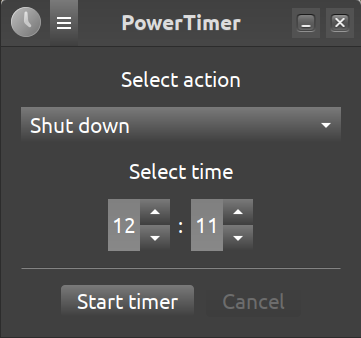
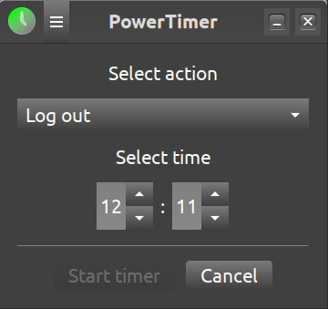

# PowerTimer

PowerTimer is a small GTK 3 desktop application for scheduling a power action at a specific local time. It is designed for Linux Mint Cinnamon and keeps a running timer accessible from the Cinnamon panel.


**Screenshots**


When a timer is active, the icon turns into a green state in titlebar and tray.


## Features

- Schedule an action for a precise time of day; a time that has already passed is scheduled for the next day.
- Choose from **Shut down**, **Restart**, **Log out**, **Suspend**, or **Hibernate**.
- Show the remaining time in a Cinnamon panel icon while the timer is active.
- Restore the main window or quit from the panel icon's menu.
- Cancel a running timer at any time.
- Display a final 60-second confirmation dialog before shutdown or logout, with options to cancel or execute immediately.
- Automatically disable hibernation when the system reports that it is unavailable.

## Requirements

- Linux Mint Cinnamon (the panel icon uses XApp)
- Python 3
- GTK 3 and PyGObject (`gi`)
- XApp GObject introspection bindings
- A working D-Bus session and `systemd-logind` for power actions

On Linux Mint or another Debian-based distribution, install the runtime dependencies with:

```bash
sudo apt install python3 python3-gi gir1.2-gtk-3.0 gir1.2-xapp-1.0
```

The availability of individual power actions also depends on system policy, session configuration, and hardware support. The desktop may ask for authentication before performing an action.

## Run

Clone the repository and start the application from its project directory:

```bash
git clone https://github.com/Jens-Olaf-Mueller/powertimer.git
cd powertimer
python3 main.py
```

PowerTimer loads its UI, stylesheet, and icons from relative paths, so it should be started from the project directory.

## Usage

1. Select the desired power action.
2. Enter the target time in 24-hour `HH:MM` format, or use the arrow controls.
3. Select **Start timer**.
4. While the timer runs, PowerTimer hides its main window and displays the remaining time in the Cinnamon panel. Use the panel menu to restore the window or quit.
5. Select **Cancel** in the main window—or in the final confirmation dialog, where available—to stop the scheduled action.

If the selected time is equal to or earlier than the current local time, the action is scheduled for the following day.

## Project structure

```text
main.py             Application entry point and timer/power-action logic
timer_dialog.py     Final countdown confirmation dialog
tray_icon.py        Cinnamon XApp panel icon integration
about.py            GTK About dialog
appinfo.py          Application metadata
ui/powertimer.ui    GTK Builder user interface
ui/style.css        Application styles
icons/              Idle and active application icons
```

## License

PowerTimer is licensed under the [GNU General Public License v3.0](LICENSE).

## Author

Jens-Olaf Mueller
